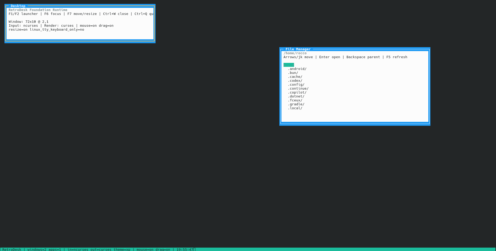

# RetroDesk

A retro desktop environment for the terminal, written in C11 with explicit
runtime ownership, platform adapters, a backend-neutral drawing model, and a
strict automated test matrix.

[](LICENSE)
[]()
[]()

> Canonical status: [docs/PROJECT_STATUS.md](docs/PROJECT_STATUS.md)  
> Known risks: [docs/KNOWN_ISSUES.md](docs/KNOWN_ISSUES.md)

## What RetroDesk Is

RetroDesk is a portable, keyboard-first terminal desktop runtime. It hosts
multiple applications inside managed windows and keeps input, rendering,
storage, lifecycle, and platform-specific behavior behind explicit contracts.

It began as a C rewrite of
[RetroTUI](https://github.com/roccolate/retrotui), but RetroTUI is now treated as
a behavior reference and risk catalog rather than an architecture template.
RetroDesk has its own layered runtime, tests, and portability policy.

The project is useful enough to exercise real File Manager and Notepad workflows,
but it remains **pre-alpha**. No stable release tag exists, and release claims
require automated and interactive evidence tied to one exact candidate commit.

## Current State

The current `main` includes:

- one Desktop event loop and one frame-flush point;
- a multi-window manager with focus, z-order, modal routing, close, drag,
  minimize/restore, maximize/unmaximize, and keyboard move/resize;
- a themed interactive taskbar and bottom-left Start-menu-style Launcher;
- XP, Hacker, Amiga, and Win31 desktop-surface treatments;
- File Manager navigation and non-destructive basic mutations;
- UTF-8 Notepad editing, selection, clipboard, undo/redo, Find, Word Wrap, save,
  version conflict handling, and safe dirty close;
- native storage adapters for POSIX, Win32, and DJGPP/DOS;
- curses and ANSI render paths plus curses/PDCurses and raw-TTY input paths where
  supported;
- optional budgeted app services for future PTY/network/subprocess workloads;
- strict Linux, Windows, sanitizer, and DOSBox-X development gates.

Two older branches are **not** integrated:

- PR #27: checked collection growth and deterministic `WindowId` exhaustion;
- PR #24: native responsive Notepad File/Edit/View menu chrome.

Do not treat features from those PRs as part of `main` until they are rebuilt on
current history and merged.

## Feature Overview

### Desktop and windows

- Focus and z-order management.
- Capability-gated title-bar drag.
- `F6` focus cycling.
- Taskbar minimize/restore.
- `F8` maximize/unmaximize and title-bar double click.
- `F9` keyboard move/resize mode with live geometry HUD.
- Fixed and modal window policy.
- Lifecycle-aware `Ctrl+W` close.
- Transactional `Ctrl+Q` shutdown across dirty applications.

### Taskbar and Launcher

- Separate Apps, application, separator, and clock regions.
- Idle, running, focused, menu-open, and clock visual states.
- Multiple-instance counts.
- Responsive full/compact labels.
- Exact mouse hit regions.
- Start-menu-style Launcher anchored above the bottom-left taskbar.
- Keyboard navigation, Home/End, accelerators, and mouse selection.

### Built-in applications

- **File Manager** — directory traversal, scrolling, hidden files, refresh,
  regular-text open, rename, new directory, and new empty file.
- **Notepad** — validated UTF-8 editing, display-cell rendering, multiline
  selection, process-local clipboard, bounded undo/redo, Find, soft Word Wrap,
  Save/Save As, conflicts, recovery, and Save/Discard/Cancel close.
- **Diagnostics** — runtime/backend/capability information. It is not a shell or
  terminal emulator.

### Storage

- **POSIX:** complete native adapter with temporary-file atomic replacement.
- **Win32:** UTF-8 public API over UTF-16 Win32 paths, Unicode filenames/data,
  deterministic listing, native identity/version tokens, and Win32 atomic
  replacement APIs.
- **DJGPP/DOS:** native reduced adapter with DOS path semantics, ASCII-oriented
  filenames, validated UTF-8 content, deterministic case-insensitive listing,
  and backup/restore replacement.

See [docs/STORAGE.md](docs/STORAGE.md) for exact guarantees and limitations.

## Platform Position

| Profile | Current position |
| --- | --- |
| Linux + ncurses | Primary development and product profile; pre-alpha |
| Linux raw TTY + ANSI | Experimental fallback requiring broader manual terminal evidence |
| Windows + PDCurses | Strict Debug/Release tests and native Win32 storage are integrated; interactive maturity evidence remains incomplete |
| DOS + DJGPP/PDCurses | Native reduced profile with automated build, storage contract, DOSBox-X smoke, and artifact generation |
| macOS | Experimental and currently unvalidated |

A successful build is not automatically a release-support claim. See
[docs/PORTABILITY.md](docs/PORTABILITY.md).

## Preview



The screenshot may lag current taskbar/Launcher polish; the behavior and status
documents are authoritative.

## Build

### Linux prerequisites

```bash
# Debian / Ubuntu
sudo apt install build-essential cmake libncurses-dev

# Fedora
sudo dnf install gcc cmake ncurses-devel

# Arch Linux
sudo pacman -S base-devel cmake ncurses
```

### Configure and build

```bash
git clone https://github.com/roccolate/retrodesk.git
cd retrodesk
cmake -S . -B build
cmake --build build --parallel
./build/retrodesk
```

The repository Makefile is a thin CMake wrapper:

```bash
make                # configure and build
make test           # Debug tests
make test-all       # Debug + Release and manifest parity
make test-sanitize  # ASan/UBSan/leak gate where supported
make smoke          # interactive PTY smoke
make smoke-linux-vc # TERM=linux keyboard-first smoke
make smoke-ci       # non-interactive startup smoke
```

Windows, DOS, and macOS instructions are in [INSTALL.md](INSTALL.md).

## Run Options

```bash
# Themes
./build/retrodesk --theme=xp
./build/retrodesk --theme=hacker
./build/retrodesk --theme=amiga
./build/retrodesk --theme=win31

# Rendering/input profiles
./build/retrodesk --render-backend=curses
./build/retrodesk --render-backend=ansi
./build/retrodesk --input-backend=curses
./build/retrodesk --input-backend=tty

# Diagnostics
./build/retrodesk --bench-startup
./build/retrodesk --diagnose
./build/retrodesk --help
```

Backend combinations are platform-validated. Unsupported combinations fail
explicitly instead of silently selecting a partial implementation.

## Essential Desktop Controls

| Key | Action |
| --- | --- |
| `F1` | Open the Launcher |
| `F10` | Open the Launcher, or close it when focused |
| `F6` | Focus the next eligible window |
| `F8` | Maximize or restore the active ordinary window |
| `F9` | Enter keyboard move mode |
| `Ctrl+W` | Request close of the active app window |
| `Ctrl+Q` | Begin coordinated shutdown |

Inside `F9` mode:

- arrows move or resize;
- `Tab` switches between MOVE and RESIZE;
- `Enter`, `F9`, or `Esc` finish;
- a themed HUD shows mode, geometry, and available controls.

The complete input contract is in
[docs/KEYBOARD_SHORTCUTS.md](docs/KEYBOARD_SHORTCUTS.md).

## Taskbar Behavior

The bottom row is a themed taskbar rather than a textual diagnostic legend.
Depending on width, it renders full or compact controls for:

```text
Apps | Files | Notepad x2 | Diag                         19:42:33
```

- Clicking Apps toggles the Launcher.
- Clicking a closed app launches it.
- Clicking a running background app focuses it.
- Clicking the focused app minimizes its active window.
- Clicking a minimized app restores, focuses, and raises it.
- Multiple instances cycle deterministically.

The current catalog is fixed to Files, Notepad, and Diagnostics. A general
overflow model is still pending.

## Architecture at a Glance

```text
src/
├── main.c                 entry point and CLI result handling
├── core/                  Desktop lifecycle, services, clipboard, UTF-8 helpers
├── platform/              curses/PDCurses and raw-TTY normalized input
├── render/                backend-neutral draw lists, curses and ANSI rendering
├── wm/                    windows, focus, z-order, drag, minimize/maximize state
├── app/                   descriptor registry and hosted app lifecycle
├── apps/                  File Manager, Notepad, Diagnostics
├── ui/                    widgets, themes, taskbar, Launcher, desktop bridges
└── storage/               portable contract plus POSIX, Win32, and DJGPP adapters
```

Important architectural invariants:

- no nested app/modal event loops;
- apps and widgets append draw commands but never flush;
- backend-native types stay inside platform/render adapters;
- file apps use `retro_fs` rather than native filesystem calls;
- platform differences are capabilities or adapters, not hidden partial behavior;
- ownership and cleanup are explicit.

See [docs/ARCHITECTURE.md](docs/ARCHITECTURE.md).

## Testing

The repository validates behavior with always-active test oracles; it does not
use release-disabled `assert()` as the sole oracle.

```bash
make check-test-oracles
make test
make test-all
make test-sanitize
make smoke-ci
```

Current automated development coverage includes Linux static analysis,
Debug/Release tests, sanitizers, manifest comparison, Windows Debug/Release,
pinned DJGPP build, native DOS storage contract, DOSBox-X application smoke, and
DOS artifact generation.

Interactive visual/input acceptance is still required for release claims. See
[docs/TESTING.md](docs/TESTING.md).

## Current Limitations

- No stable release tag or exact candidate evidence bundle.
- No taskbar overflow surface for a future larger app catalog.
- Desktop integration remains concentrated and uses temporary private bridge
  macros/state that should be replaced by explicit per-instance controllers.
- Checked collection growth and deterministic `WindowId` exhaustion are proposed
  in stale PR #27, not integrated.
- Native responsive Notepad menu chrome is proposed in stale PR #24, not
  integrated.
- File Manager lacks destructive/recursive operations, copy/move, previews,
  bookmarks, and dual-pane mode.
- Notepad lacks Replace, native system clipboard, mouse editing, normalization,
  syntax highlighting, multiple encodings, and a large-file strategy.
- Diagnostics is not a terminal emulator.
- Windows and DOS have native storage but still need broader interactive product
  evidence; macOS is unvalidated.
- Full Unicode normalization and terminal-width behavior are intentionally not
  claimed.

The maintained risk register is
[docs/KNOWN_ISSUES.md](docs/KNOWN_ISSUES.md).

## Documentation

Recommended entry points:

- [docs/PROJECT_STATUS.md](docs/PROJECT_STATUS.md) — exact current state.
- [docs/KNOWN_ISSUES.md](docs/KNOWN_ISSUES.md) — active risks and limitations.
- [docs/INDEX.md](docs/INDEX.md) — complete reading order.
- [docs/ARCHITECTURE.md](docs/ARCHITECTURE.md) — runtime contracts.
- [docs/BUILTIN_APPS.md](docs/BUILTIN_APPS.md) — application behavior.
- [docs/KEYBOARD_SHORTCUTS.md](docs/KEYBOARD_SHORTCUTS.md) — input reference.
- [docs/STORAGE.md](docs/STORAGE.md) — filesystem guarantees.
- [docs/PORTABILITY.md](docs/PORTABILITY.md) — platform claims.
- [docs/TESTING.md](docs/TESTING.md) — validation strategy.
- [docs/ROADMAP.md](docs/ROADMAP.md) — next work.
- [docs/RELEASE_0.1_CHECKLIST.md](docs/RELEASE_0.1_CHECKLIST.md) — release gate.

## License

MIT — see [LICENSE](LICENSE).

## Acknowledgements

- [RetroTUI](https://github.com/roccolate/retrotui) — behavior reference and risk
  catalog.
- ArmoniOS — source of the taskbar behavior model reused under the project's MIT
  licensing decision.
- Contributors and reviewers who hardened the runtime, platform adapters, apps,
  tests, and documentation.